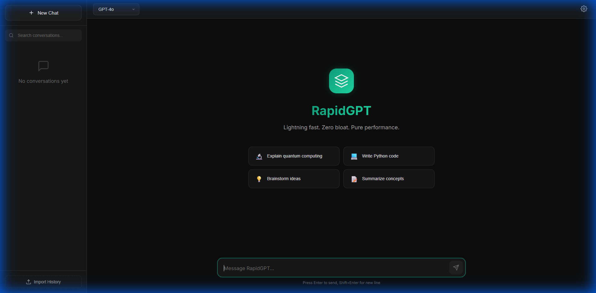
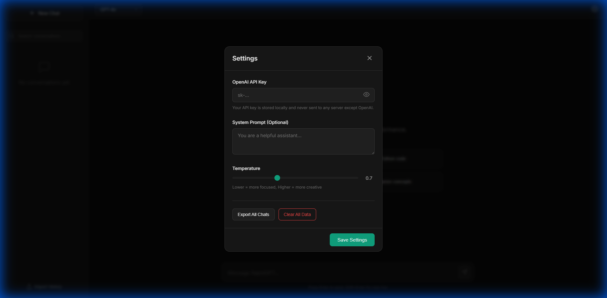
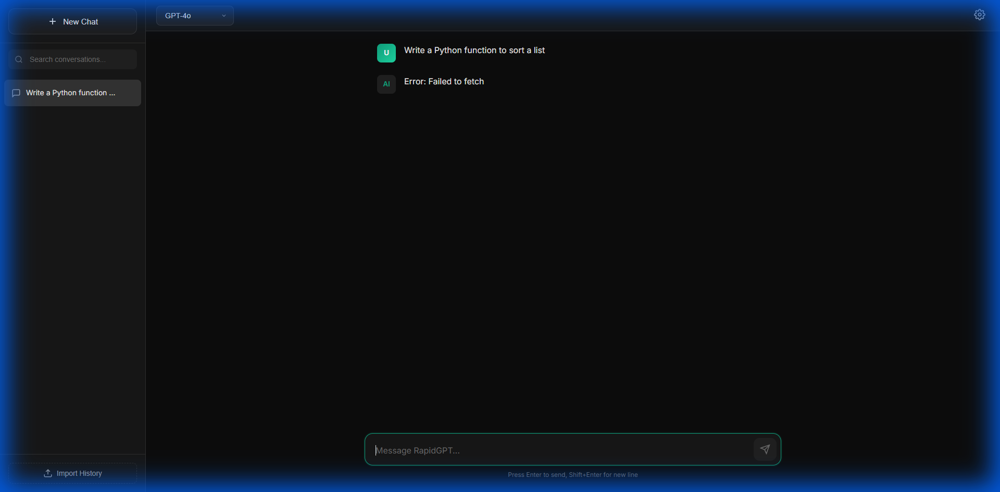

# ⚡ RapidGPT

**Lightning fast ChatGPT client. Zero bloat. Pure performance.**

A lightweight alternative to ChatGPT's web app that eliminates memory leaks, lag, and the 3GB+ RAM usage caused by React's virtual DOM overhead.


---

### 🖼️ Screenshots





---

## 🚀 Quick Start

```bash
# Clone & Run
bun install
bun run dev
```

Open **http://localhost:3000** and add your OpenAI API key in Settings (⚙️).

---

## ✨ Features

| Feature | Description |
|---------|-------------|
| 🔑 **API Key Management** | Securely stored in localStorage, never leaves your browser |
| 🤖 **Multiple Models** | GPT-4o, GPT-4o Mini, GPT-4 Turbo, GPT-4, GPT-3.5, o1-preview, o1-mini |
| 💬 **Streaming Responses** | Real-time token streaming like the native app |
| 📝 **Markdown Rendering** | Bold, italic, code blocks with syntax highlighting |
| 📋 **Copy Code Blocks** | One-click copy for all code snippets |
| 📚 **Conversation History** | Auto-saved, searchable, no limits |
| 🔍 **Full-Text Search** | Instantly search across all conversations |
| 📥 **Import ChatGPT History** | Import your existing chats (JSON export) |
| 📤 **Export Conversations** | Backup your conversations anytime |
| 🌙 **Dark Mode UI** | Modern glassmorphism design |
| 📱 **Responsive** | Works on desktop and mobile |

---

## 🎯 Why RapidGPT?

### The Problem with ChatGPT's Web App

| Metric | ChatGPT Web | RapidGPT |
|--------|-------------|----------|
| DOM Nodes after scrolling | 89,424 | ~100 |
| Memory Usage | 3.17 GB | ~20 MB |
| Active Timers | 23,584 | 0 |
| FPS during scroll | 1-5 | 60 |

ChatGPT's React-based webapp has classic memory leak issues. The iOS app is smooth because it's native Swift with proper memory management. RapidGPT brings that performance to the browser.

---

## 🛠️ Tech Stack

- **Frontend**: Vanilla HTML/CSS/JavaScript (~350 lines)
- **Runtime**: Bun
- **API**: OpenAI Chat Completions (streaming)
- **Storage**: localStorage (no backend required)

---

## 📁 Project Structure

```
├── index.html      # Main HTML structure
├── styles.css      # Dark mode design system
├── app.js          # All application logic
├── server.ts       # Bun dev server
└── package.json    # Project config
```

---

## ⚙️ Configuration

### Settings Modal (⚙️ icon)

| Setting | Description |
|---------|-------------|
| **API Key** | Your OpenAI API key (sk-...) |
| **System Prompt** | Optional custom instructions |
| **Temperature** | 0 = focused, 2 = creative |

---

## 📥 Importing ChatGPT History

1. Go to [ChatGPT Settings](https://chat.openai.com/) → Data Controls → Export Data
2. Download your export ZIP
3. Extract and locate `conversations.json`
4. In RapidGPT, click **Import History** and select the file

---

## ⌨️ Keyboard Shortcuts

| Shortcut | Action |
|----------|--------|
| `Enter` | Send message |
| `Shift + Enter` | New line |
| `Escape` | Close settings modal |

---

## 📄 License

MIT License - Use freely for personal and commercial projects.

---

<p align="center">
  Built with ❤️ for speed
</p>
